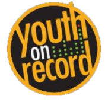
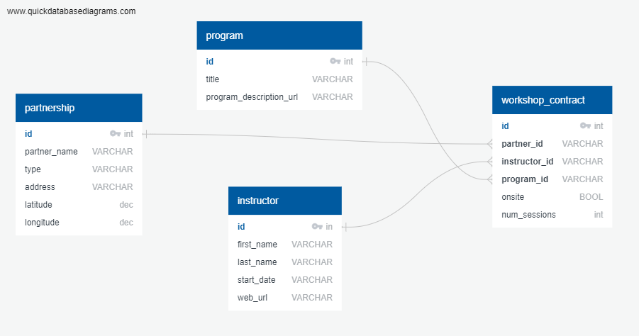

# Youth On Record - Empowerment Through Creative Education

### Link: https://www.youthonrecord.org/

YOR is a Denver based non-profit that I have been involved with for many years. They have been big supporters of the at-risk youth community as well as local music, and were there for my band Los Mocochetes when we first got our start in the spring of 2017, allowing us to rehearse in their state of the art Youth Media Studio for several years. Originally founded by members of hip-hop group the Flobots and their venture into service with Flobots.org, Youth On Record has partnered with schools, youth facilities, libraries, and many others, impacting over 1,000 youth annually.

While my involvement as a volunteer has taken on a few different forms over the years, including tuning and maintaining drums, performing at the annual block party, and eventually taking on the digital mapping intiative to build an interactive map to showcase their community impact (See the prototype on Heroku here: https://lit-ocean-77747.herokuapp.com/)

### ETL - Extract, Transform, and Load!

Like many non-profits, keeping data organized can be a work in a progress, with a lot of scattered data sources. Part of the challenge building the first map was that the data for the workshops was a collection of spreadsheets, hard-coded location data for the schools and libraries sourced from google, and info that was pulled from the website. But...with no database, there was no place to store and access the data for the map! I ended up hard-coding the data as JavaScript objects in the map itself until we found a better home.

ETL stages:

- create a Postgres database to store the map data, and extract the JSON that was hard-coded into the prototype map so it can be loaded from a secure location.
- We have plans to add additional data on Music Ambassadors to the map, some of which are international touring musicians which till take us outside of the Denver city bounds. At the moment we are still getting organized for this second phase.
- Since beginnning this project, I've met with the Director of Visibility and Operations to discuss our plans, and learned that YOR has been slowly migrating their data to a partner Salsa Labs, who offer a robust CRM platform. There will be more ETL work down the road to interact with the Salsa labs database and help the YOR team with data wrangling, formatting, and reporting.
- A final project idea is to build an image recognition app to process printed workshop surveys and push the results to the database.

### YOR Database Plan and Schema Diagram:

With more of the data being migrated to Salsa Labs, we only need a few tables to store map-related data. Meanwhile, with only a dozen or so map markers, and a shift towards digital programming during the pandemic, an AWS S3 bucket to store these static lists may be a better fit. The schema diagram above shows the following tables:

- Partnership Table to store the name, location/address, and geographic coordinates of each partnering organization, along with type (School, Library, Youth facility etc)
- Instructor table with instructor name and link to their bio page on the YOR website
- Program table to store the name of each class offered, and a link to the description on the YOR website
- Workshop information such as number of sessions, program offered, instructor, and partner. As many contracts are recurring for each school year, these would be linked to each partnering organization's id
